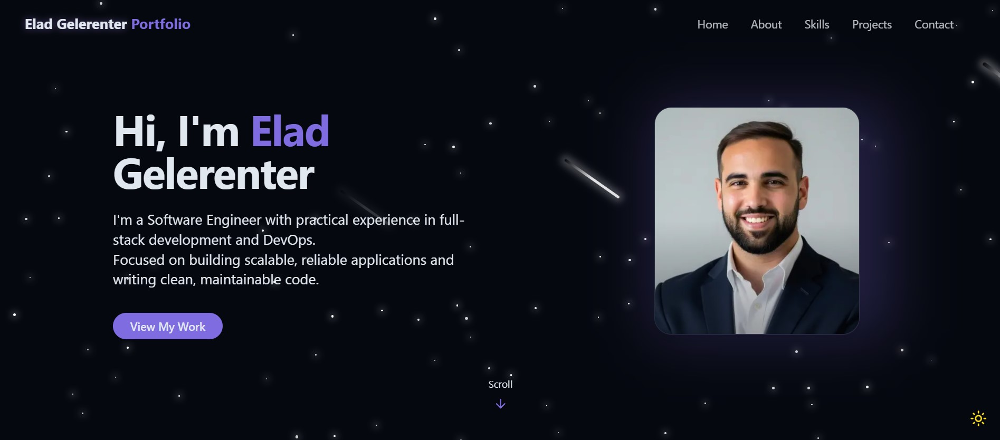
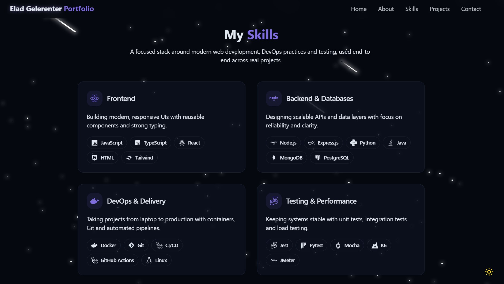
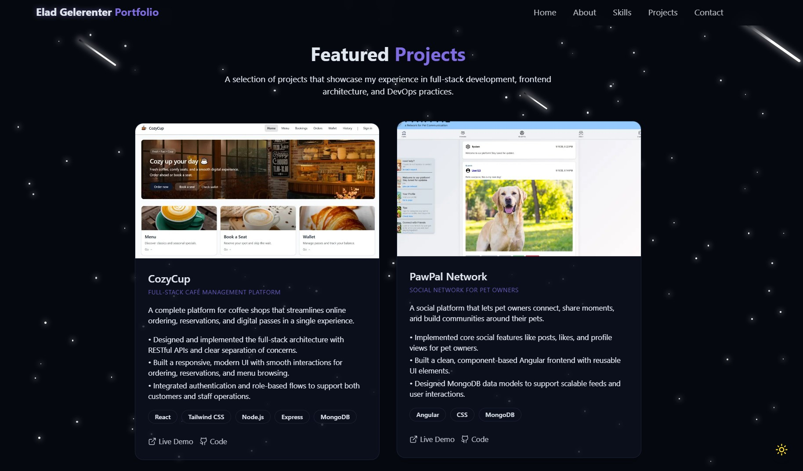

# 🚀 My Personal Portfolio

A modern, responsive personal portfolio showcasing my projects, skills, and experience as a software engineer.

---

## ✨ Overview

This repository contains my **personal portfolio website**, built to present who I am, what I build, and how I approach software engineering.

The portfolio is designed to be:

- Clean and visually appealing  
- Professional and easy to navigate  
- Focused on real engineering experience and practical project showcases  

It serves both as a **professional showcase** and a **living project** that evolves alongside my skills.

---

## 🌍 Live Website

🔗 **Production URL:**  
https://elad-personal-portfolio.vercel.app/

> Hosted on **Vercel**, with automatic deployments triggered by Git pushes.

---

## 🧭 What You’ll Find Here

- **Home Section** - Professional introduction, profile image, and CTA.

- **About Me** - Clear summary of my background, experience, and focus areas.

- **Skills** -Technologies and tools I've experience with.

- **Featured Projects** - Expanded project cards with detailed descriptions, tech stacks, and links.

- **Contact** - Easy way to get in touch for collaborations or opportunities.

---

## 🛠️ Tech Stack

### **Core**
- Next.js 14 (App Router)
- React
- JavaScript
- TailwindCSS

### **Optimizations**
- `next/image` for automated image optimization  
- Server Components & Static Rendering  
- Route-based layouts and parallel rendering  

### **Deployment**
- **Vercel** (Automatic builds & CDN caching)

---

## 📁 Project Structure

```bash
app/             # App Router: pages, layouts, routes
components/      # Reusable UI components
public/          # Static assets
lib/             # Utility functions/helpers
styles/          # Global styles
README.md        # Documentation
```

This replaces the older **Vite + src/** structure.

---

## 🚀 Local Development

### Requirements
- Node.js LTS  
- npm or yarn

### Install & Run

```bash
npm install
npm run dev
```

Then open:

```
http://localhost:3000
```

---

## 🎨 UI & UX Highlights

- Clean, modern, professional design  
- Fully responsive layout
- Optimized images for faster loading  
- Subtle, non-intrusive animations  

---

## 📸 Screenshots

<p align="center">
  
  <br/><em>Home Section</em>
</p>

<p align="center">
  
  <br/><em>Skills Section</em>
</p>

<p align="center">
  
  <br/><em>Projects Section</em>
</p>

---

## 🤝 Contact

Interested in collaborating or have opportunities to discuss?  
Feel free to reach out - always open for meaningful conversations.

---
