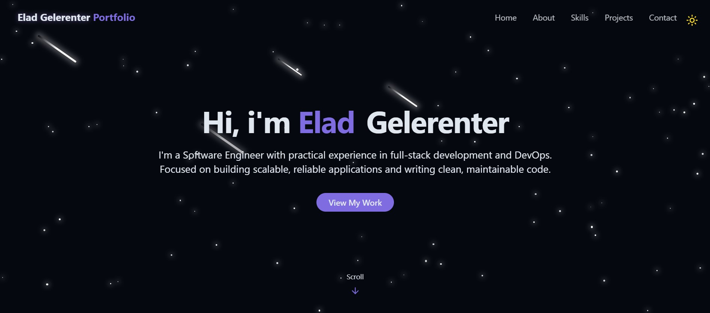
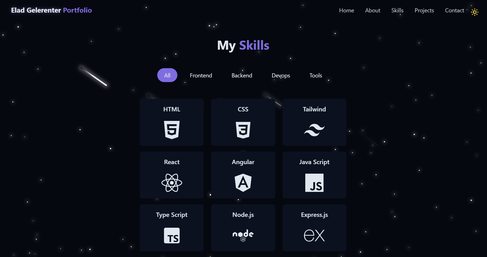
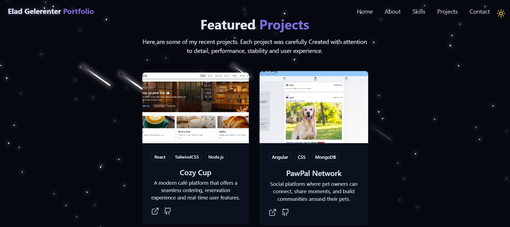

# 🚀 My Personal Portfolio

A modern, responsive personal portfolio showcasing my projects, skills, and experience as a software engineer.

---

## ✨ Overview

This repository contains my **personal portfolio website**, built to present who I am, what I build, and how I approach software engineering.

The portfolio is designed to be:
- Clean and visually appealing
- Easy to navigate
- Focused on real projects and practical experience

It serves both as a **professional showcase** and as a **living project** that evolves alongside my skills.

---

## 🌍 Live Website

🔗 **Production URL:**  
https://my-personal-portfolio-eight-pied.vercel.app

> The site is deployed and publicly accessible. It is optimized for desktop and mobile devices.

---

## 🧭 What You’ll Find Here

- **About Me** - a concise introduction and professional summary
- **Skills** - technologies and tools I've experience with
- **Projects** - selected projects with descriptions and links to repositories
- **Contact** - contact section for opportunities and collaborations

Each section is built with clarity and user experience in mind.

---

## 🛠️ Tech Highlights

While this is primarily a presentation-focused project, it follows solid engineering principles:

- Component-based architecture
- Dark-first UI with theme toggle
- Responsive layout for all screen sizes
- Clean and maintainable code structure

---

## 📂 Project Structure

```bash
src/
├── assets/        # Images, icons and static assets
├── components/    # Reusable UI components
├── lib/           # Utility functions
├── pages/         # Website main pages
├── App.jsx        # Root component
├── main.jsx       # Application entry point
```

---

## 🚀 Local Development

### Prerequisites

- Node.js (LTS recommended)
- npm

### Install & Run

```bash
npm install
npm run dev
```

The application will be available locally at the development server URL shown in the terminal.

---

## 🎨 UI & UX Notes

- Default theme is **dark mode** for a modern look and feel
- Theme can be toggled manually by the user
- Layout emphasizes readability and visual hierarchy
- Subtle animations and transitions enhance the experience without distraction

---

## 📸 Screenshots

<p align="center">
  
  <br/><em>Home Section</em>
</p>

<p align="center">
  
  <br/><em>Skills Section</em>
</p>

<p align="center">
  
  <br/><em>Projects Section</em>
</p>

---

## 🤝 Get In Touch

Looking for new opportunities or interested in collaborating?

Feel free to reach out - I’m always open to meaningful conversations, feedback, and exciting projects.

---

